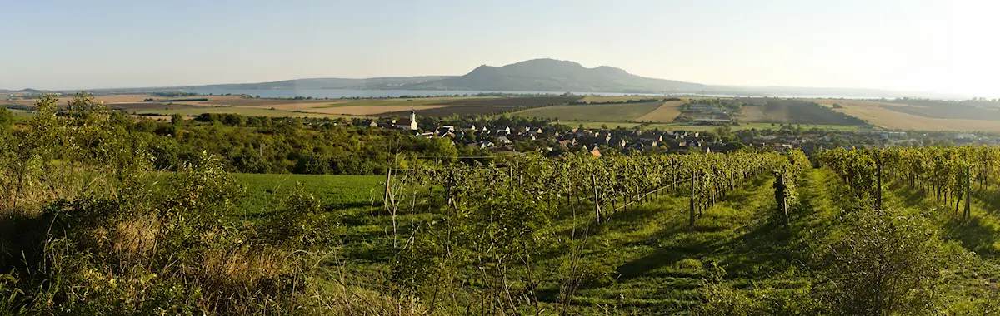

# pano-blend

A C++23 / OpenCV panoramic image blender. It finds the least-visible seams
between overlapping images with a **Boykov–Kolmogorov graph cut**, then
composites them with a **Laplacian-pyramid (multi-band) blend** so the joins
disappear across all spatial frequencies. Handles N images and reads image
placement straight from Hugin/nona TIFF tags.

The algorithm is a modern reconstruction of **SmartBlend** (Michael Norel, 2007) —
a once-popular Hugin plugin that is Windows-only, 32-bit, and no longer
compatible with current Hugin. See [`doc/re_provenance.md`](doc/re_provenance.md)
for what was recovered from the original binary vs. designed fresh.



## Why

SmartBlend often produced better panorama joins than the default `enblend`, but
it is unmaintained, single-platform, and needs full-resolution uncropped input.
`pano-blend` aims to reproduce its results as portable, modern C++:

- **Perceptual seam cost** — colour difference measured in OKLab (ΔE), where
  Euclidean distance tracks perceived difference.
- **Optimal seam** — coarse-to-fine BK min-cut threads the seam through the path
  of least visible colour disagreement.
- **Invisible transition** — a Burt–Adelson pyramid blends low frequencies over a
  wide band and high frequencies over a narrow one.
- **Drop-in-ish for enblend** — accepts positional TIFF input, `-o`, and
  `-f WxH+X+Y` canvas geometry; reads `XPOSITION`/`YPOSITION` placement tags.

How each stage works is written up in [`doc/algorithm.md`](doc/algorithm.md).

## Build

**Linux** (openSUSE / Fedora — see [`doc/build-instructions-linux.md`](doc/build-instructions-linux.md)):

```sh
sudo zypper in libtiff-devel opencv-devel gtest   # openSUSE Tumbleweed
cmake -S . -B build -DCMAKE_BUILD_TYPE=Release
cmake --build build --parallel
ctest --test-dir build                            # optional: run the tests
```

**Windows** (Visual Studio + Conan): see
[`doc/build-instructions-windows.md`](doc/build-instructions-windows.md).

## Usage

```sh
# Blend two or more positioned TIFF layers into one panorama
pano-blend img1.tif img2.tif [img3.tif ...] -o pano.tif
```

The repo ships two small overlapping test frames, so you can try it immediately
after building (`p2` is placed at x=85 over `p1`):

```sh
pano-blend test-data/p1.tif test-data/p2.tif -o pano.tif
```

Image positions are read from each TIFF's `XPOSITION`/`YPOSITION` tags, or given
explicitly with `-xoff`/`-yoff` (offsets may be negative):

```sh
pano-blend left.tif right.tif -xoff 850 -yoff 0 -o pano.tif
```

| Option | Meaning |
|---|---|
| `-o F` / `--output F` | output TIFF |
| `-f WxH+X+Y` | force canvas geometry (enblend-compatible; negative offsets ok) |
| `-SeamMaskOnly F` | write the label map (0 = uncovered, 1..N = image index) and exit |
| `-LoadLabelMap F` | blend using a label map from `-SeamMaskOnly` (skips seam finding) |
| `-SeamVerbose` | write per-pair debug TIFFs plus a colorized `labelmap_viz.tif` + `labelmap_legend.tif` |
| `@file` | read arguments from a response file, one per line (Hugin emits these on Windows) |
| `-w [MODE]`, `--wrap[=MODE]` | parsed for enblend compatibility; wrap blending not implemented (warns unless `none`) |
| `-v` | accepted and ignored (enblend compatibility) |
| `--version` | print version and exit |

### With Hugin

`pano-blend` is a blender, not a stitcher — it needs pre-warped, positioned
layers, which is exactly what Hugin's `nona` produces. The full manual workflow
(`nona -m TIFF_m` → `pano-blend`) is in
[`doc/hugin-workflow.md`](doc/hugin-workflow.md).

To call it from the Hugin GUI, two settings matter:

1. **Preferences → Programs → enblend** — point the executable at
   `pano-blend`.
2. **Stitcher tab → Blender: "enblend" (external)** — with the default
   *builtin blender*, Hugin uses its internal verdandi and never calls the
   external program. (Telltale symptom: extra arguments fail with verdandi's
   getopt-style error, e.g. `-SeamVerbose` → `unknown parameter "-S"`.)

Extra flags such as `-SeamVerbose` go in the enblend arguments field; debug
TIFFs are written to the stitch's working directory.

## Status

Verified on single-row strips of 3–5 images (e.g. five 6232×4156 frames → an
11288×5153 canvas). Grayscale and 16-bit input load; the seam cost currently
assumes colour (OKLab).

Seams are found sequentially, SmartBlend-style: images are placed in a
deterministic maximum-overlap order growing from the panorama's center, and
each newcomer is graph-cut against the composite of everything placed before
it — N−1 cuts total, coherent at any number of overlapping images. Very large
(tiled, out-of-core) panoramas are planned —
see [`doc/large-panorama-plan.md`](doc/large-panorama-plan.md).

## Credits & licence

Reconstructed from the SmartBlend RE described in
[`doc/re_provenance.md`](doc/re_provenance.md). Graph cut via OpenCV's
`cv::detail::GCGraph` (Boykov–Kolmogorov); pyramid blend via
`cv::detail::MultiBandBlender`.

Licensed under the [MIT License](LICENSE).
